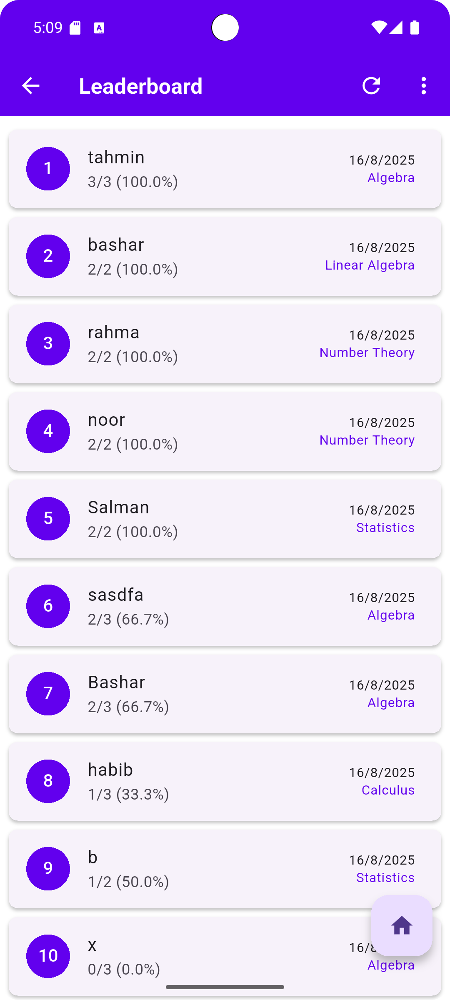
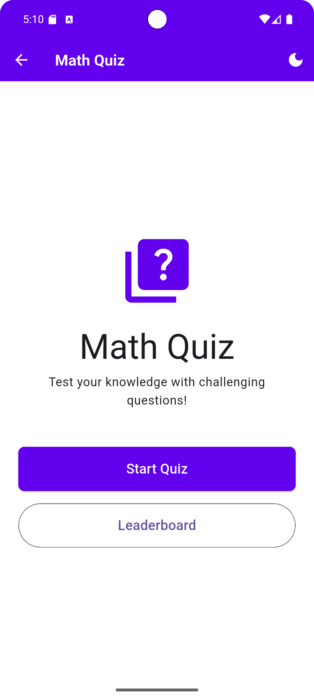
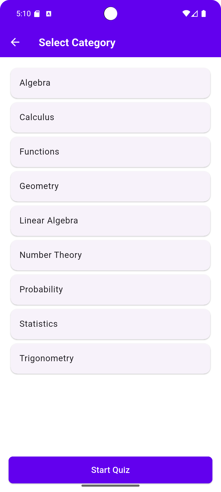
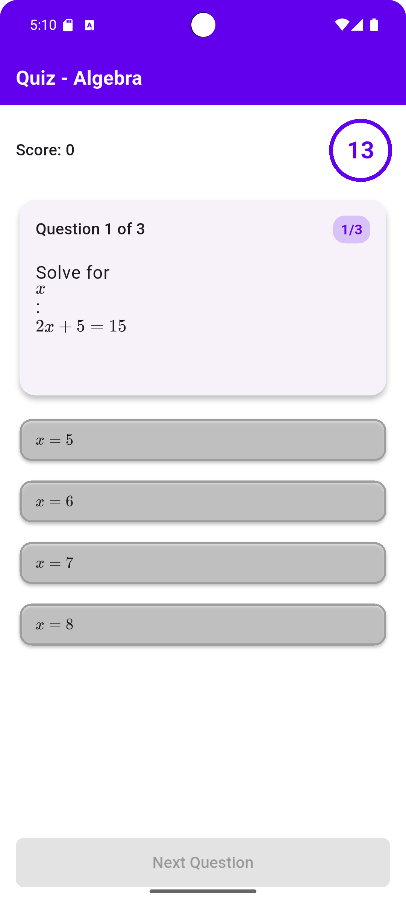

# Flutter Quiz App

A mobile quiz application built with Flutter that loads questions from a local file, supports LaTeX for math/science questions, runs a quiz, calculates scores, and stores a local leaderboard.

## ✨ Features

*   **Home Screen:** App title with navigation buttons to start quiz or view leaderboard.
*   **Category Selection:** Choose from various quiz categories before starting.
*   **Dynamic Quiz Flow:**
    *   Loads questions from a local JSON file.
    *   **LaTeX Rendering:** Supports mathematical and scientific equations using LaTeX.
    *   **Timed Questions:** Each question has a 15-second countdown timer.
    *   **Progress Indicator:** Clearly shows the current question number out of the total.
    *   **Smooth Animations:** Fluid transitions between questions for a better user experience.
*   **Results Screen:**
    *   Displays the final score.
    *   Option to enter a name to be saved with the score.
    *   Saves scores to a local leaderboard.
*   **Leaderboard Screen:**
    *   Shows top scores sorted from highest to lowest.
    *   Persistent storage using the Hive database.
*   **Dark Mode:** Easily toggle between light and dark themes.
*   **Offline Functionality:** Works entirely without an internet connection.

## 📸 Screenshots

## 🛠 Prerequisites

*   Flutter SDK: `>=3.7.0`
*   Dart SDK: `>=2.19.0 <4.0.0`
*   Ensure Flutter is correctly installed and added to your system's PATH.

## 🚀 Setup Instructions

1.  **Clone the Repository:**
2.  **Install Dependencies:**
3.  **Generate Hive Adapters:**
    (Required for local database functionality)   
4.  **Run the App:**

## 📂 Project Structure

A brief overview of the main directories:

lib/ ├── config/         # App-wide configurations (routes, themes, constants) ├── models/         # Data models (Question, QuizResult, LeaderboardEntry) ├── screens/        # UI screens for different parts of the app ├── services/       # Business logic and data handling (QuizService, LeaderboardService) ├── widgets/        # Reusable UI components ├── utils/          # Utility functions (animations, score calculation) ├── providers/      # State management providers └── main.dart       # Main application entry point

## 🧩 Key Dependencies

*   [flutter_tex](https://pub.dev/packages/flutter_tex): For rendering LaTeX equations.
*   [hive](https://pub.dev/packages/hive): A lightweight and fast key-value database for local storage.
*   [provider](https://pub.dev/packages/provider): For state management.
*   [shared_preferences](https://pub.dev/packages/shared_preferences): For simple data persistence (like theme settings).

## 🧪 Testing

Run unit tests using the following command:

## 🤖 Continuous Integration

This project uses GitHub Actions for CI. The workflow (`.github/workflows/main.yml`) automatically runs:
*   `flutter analyze` to check for code issues.
*   `flutter test` to execute unit tests on every push and pull request.

## ➕ Adding Questions

Questions are stored in `assets/questions.json`. Each question should follow this format:

json [ { "id": "1", "category": "Algebra", "question": "Solve for x: $2x + 5 = 15$", "options": ["x = 5", "x = 6", "x = 7", "x = 8"], "correctAnswerIndex": 0, "explanation": "Subtract 5 from both sides: 2x = 10. Then divide by 2: x = 5." } // Add more questions here ]

Ensure your JSON is valid before running the app.

## 🤝 Contributing

Contributions are welcome! Please follow these steps:

1.  Fork the repository.
2.  Create your feature branch (`git checkout -b feature/AmazingFeature`).
3.  Commit your changes (`git commit -m 'Add some AmazingFeature'`).
4.  Push to the branch (`git push origin feature/AmazingFeature`).
5.  Open a Pull Request.

